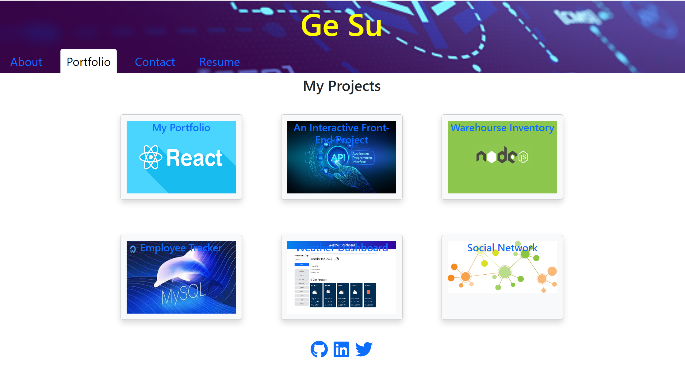

# GeSu_Portfolio



## Description

This portfolio application is created with React and BootStrap. It containes the author's general information, project details, contact method and a downloadable resume.

## Technologies Used

React

Bootstrap

Node.js

NPM

JavaScript

Visual Studio Code

## Installation

Click the link to install [Node.js](https://nodejs.org/en). To install dependencies, use the command line:

```
npm i
```

## Usage

To use this application, click the link [GeSu_Portfolio](https://github.com/gesu001/GeSu_Portfolio) to the github repository.

Clone the repository to you local computer by using the command line

    git clone https://github.com/gesu001/GeSu_Portfolio.git

Open the root directory in the integrated terminal, run the application by using command line:

    npm i
    npm start

## Contributing

Pull requests are welcome. For major changes, please open an issue first to discuss what you would like to change.

## Credits

N/A

## License

Please refer to the LICENSE in the repo.

## 💡 Reference

The Javascript code of this application refers to the following documentations:

- [React](https://legacy.reactjs.org/)

- [Node.js](https://nodejs.org/en)

- [Github](https://github.com/)

- [JavaScript](https://developer.mozilla.org/en-US/docs/Web/JavaScript)

- [w3school](https://www.w3schools.com/js/default.asp)

- [Bootstrap](https://getbootstrap.com/)

- [FontAwsome](https://fontawesome.com/)

- [npm](https://www.npmjs.com/package/inquirer)

- [How to download files in React JS ](https://www.youtube.com/watch?v=IPEqb_AJbAQ)

© 2023 GE SU @Melbourne. Confidential and Proprietary. All Rights Reserved.
